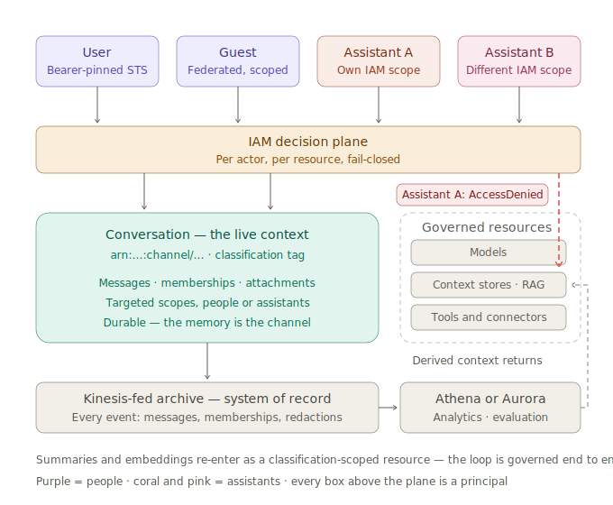
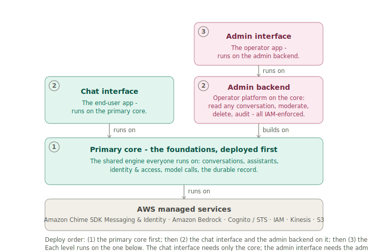

# AgentEchelon Overview

AgentEchelon is a governed, multi-party agentic AI platform that runs in your own AWS account and serves internal and customer-facing use cases from one place. A core feature is that agent governance can be enforced with AWS's own identity primitives instead of a bolted-on policy engine. Every user, assistant, and conversation is an AWS resource with an ARN; every actor holds a bearer-pinned identity, never a shared backend credential; access is an IAM decision keyed on an immutable classification tag: fail-closed, evaluated before any request runs, and provable with a deny test rather than a code review. Classifications are your labels (`internal`, `confidential`, `restricted`, whatever your data taxonomy already says), and each is served by a capability profile that fixes which model answers, at what depth, with what reach. Because enforcement is AWS-native, cost tracking and management ride the same tags and tools. Self-hosted, model-agnostic, MIT-licensed.

The point is centralization: instead of a separate tool per use case, each with its own login, data store, bill, and security review, one governed platform serves them all, and a new experience is configuration over the same platform, not a new system.

*The authority plane, not the request plane. Every actor (human or assistant) is a principal above one enforcement layer; the conversation is itself the governed resource. The record captures everything, including what was refused. (Conversation access is enforced in IAM; derived-context scoping is enforced as a fail-closed metadata filter in the data plane: two mechanisms, one policy.)*

## Where it fits

The category forming in 2026 is the *agent control plane* or *agent gateway*: the governed layer between agents and the models, tools, data, and people they reach. AgentEchelon fits it with two differences: (1) it is broader than a tool-call gateway: the same governance covers the multi-party conversation and the surfaces people arrive through, not only an agent's tool calls; and (2) its enforcement is the cloud's own (AWS IAM over tagged resources) rather than a policy service you add and then have to trust.

## How it is built: four layers

*Four layers, each running on the one below. Interface is the clients people use; Communication is the connectivity that wires each client to the engine (WebSocket + REST live, WebRTC roadmap). Interaction is the engine, AgentEchelon's own code over the AWS services it composes, where access is enforced in IAM. Foundations is how the platform is deployed and managed.*

Most agentic systems are a model, tools, memory, and an orchestration loop. AgentEchelon ships each of those and lets you customize or swap them as needed, then wraps them in the enterprise layers along with governed multi-party conversation, omnichannel capabilities, and access enforced in the cloud's own IAM. It is organized as four layers that each run on the one below:

- **Interface.** The client surfaces people use: an end-user app (a web chat client today, with mobile, phone, and email as they come online) and the operator admin app. Some are AgentEchelon-built (the web and admin apps); others are the participant's own (their phone, their email app). A client renders, holds a bearer-pinned identity, and reaches the engine through the connectivity layer below.
- **Communication.** The connectivity that wires each client to the engine: the web (and mobile) client sends and receives over WebSocket and REST APIs for messaging today, with WebRTC for real-time next. Email already hands off outbound (inbound next), and voice (PSTN) and other channels follow the same model - the seam is there, each on a provider you choose rather than one the platform hard-codes. Adding connectivity never changes the engine.
- **Interaction.** The engine, custom-built: AgentEchelon's own code composed over several AWS services at different levels (Amazon Chime SDK Messaging for conversations, identity, roles, retention, and channel flows; Amazon Lex and Amazon Bedrock for inference) plus the assistants, memory, routing, configuration, auditing, and the IAM policies and classification tags that turn those services into a governed multi-party runtime. Its composition root is the *conversation type*; five pillars (identity and access, assistant configuration, conversation configuration, connectors, auditing) compose every experience. This is where "who may act, as whom, at what capability" is expressed as IAM policy by that code and then enforced by AWS IAM itself, not by application logic that has to remember to check.
- **Foundations.** How the platform is deployed and operated, not what it enforces: the AWS CloudFormation stacks (CDK) that provision every resource, resource tagging for cost allocation, and the monitoring and observability that keep it running. The tags that attribute cost are the same ones the interaction layer's IAM decisions read, so cost and governance ride one mechanism.

Inference, moderation, message delivery, and retention run on AWS-managed services, so those are AWS's to operate, not yours to build. Where a deployment already owns a system, the platform allows you to plug in what you already use rather than require a replacement for it: your **identity provider** (Amazon Cognito by default, or your SSO/SAML/OIDC), a **user-profile store** (the built-in one is a reference stand-in), and **opt-in connectors** for outside systems of record (the schema ships; the runtime path does not yet), with governed MCP as that connector seam's intended vehicle (see below). Assistants run **self-hosted tool loops** in your account, reading classification-scoped context and RAG through AWS resources you define.

AgentEchelon ships its chat and admin experiences as web interfaces you can swap for your own, and what actually stands up in your account is a small set of deployable components - detailed in What ships today, below.

## What it solves

- **Control.** You decide which model answers what; guardrails run on every model turn; retention lives in your account. Identity and classification are enforced in IAM before a request runs, with a conversation-level policy layer on top: defense in depth, not one check an application path has to remember. Every decision is recorded and queryable.
- **Low latency.** An instant placeholder becomes the answer in place, and analytics are written off the response path, so measuring a reply never slows it.
- **Cost.** Serverless with near-zero idle by default (the heavy analytics database is opt-in and can sleep), and the same routing and capability profiles that give you control hold down inference, the dominant variable cost.
- **Flexibility.** A private assistant scoped to one classification, a shared team room, a routed support case, an announcement thread: the same platform composed differently, no new code.

## What is different

A few things set it apart, each a design tenet made concrete (the full set is in [`TENETS.md`](TENETS.md)):

- **Provable, not asserted.** Governance is infrastructure, not a policy engine you bolt on: access is an IAM decision made before a request runs, identity is bearer-pinned so an actor can only act as itself, and every sensitive operation carries at least two enforcement layers, so one missed check is not a breach. You demonstrate isolation with a deny test - watching AWS refuse a cross-boundary action - not a code review that hopes every path remembered to check.
- **People and assistants on one control plane.** Humans (from chat, email, or voice, and the member who joins mid-thread) and configurable assistants act in the same conversations under the same access model. An assistant is a reusable building block assembled from a capability profile, not new code - and a **portable, versioned** one: you version it, A/B or battle any version, and move it between deployments or regions, all as config rather than a redeploy. Because a conversation composes which assistants it enrolls, a team can build an assistant for its own purpose and **insert it into a workflow another department owns** - decentralized authorship, one governed composition, with neither team forking the other's code. Several can share a room, @-mention each other to align in private, hand off work, and a single turn can fan out across them. Each is a first-class member with its own identity and scoped credentials, so "which agent acted, under what authority" falls out of the platform, and guests and federated externals act at exactly their capability.
- **Shared, compounding context.** The conversation is the unit of context: it builds across every turn and, per user, across their conversations, so no one starts from zero. Everyone in it - the external user, the member who joins, the assistant - works from the same live picture: nobody repeats themselves, whoever steps in is already caught up, and the assistant answers with full awareness, all bounded by the same access model.
- **Fine-grained control at every step.** You decide which model runs where (cost and performance), quality is measured at every step, and the assistant follows your business's policy rather than a model's defaults. A server-side hook governs each message before the assistant runs; the reply fills in place from an instant placeholder while analytics write off the response path; and when a dependency fails the assistant degrades to a helpful answer instead of leaking an error or blocking the reply.
- **The harness outlives the model.** AgentEchelon ships the complete, self-hosted loop - tool calling, guardrails, context and RAG, task tracking, drift detection - and treats the reasoning model as a replaceable function call, chosen per step and per experience. The hard parts (context, access, action, observation, delivery) are model-agnostic, and forward-compatibility is by contract: a conversation snapshots its policy, behavior keys are open registries, and schema evolves additively, so you swap the model or add experiences without breaking a deployed conversation.

And as the platform grows, the governance comes with it. The ecosystem is converging on MCP as the way agents reach tools; because access here is already an IAM decision with bearer-pinned identity, MCP tools plug into the same platform, scoped by classification, guardrailed like everything else. You get the reach and keep the control you already had. The same holds for customer-facing channels and federated identity: the seams are in place, so each is a configuration step on the governed platform, not a new system to secure.

## What ships today

Two cuts run across the four layers. **Chat interface vs admin interface**: the two clients are both platform-provided and both replaceable, on one shared app instance and user pool, differing only in vocabulary (the chat interface says *tier*; platform and admin say *classification*) and in the credentials they can obtain. **Core platform vs admin plane**: the admin plane is a cross-layer slice - the admin interface plus admin identity and IAM enforcement plus the admin-facing parts of auditing - deployed as its own backend on top of the core platform, where each privileged action gates on an IAM-enforceable capability, not group membership alone. Everything else is the core platform.

*The deployable components and the order they stand up: the primary core first; then the chat interface and the admin backend on it; then the admin interface on the admin backend. The chat interface reaches the platform in one hop, the admin interface in two.*

The internal use cases are live and governed: per-profile assistants on a self-hosted tool loop, mention routing, conversation sharing, proactive briefings, A/B experiments, drift detection, the admin console, and analytics. The sample deployment ships three classifications named `basic`/`standard`/`premium`, a tiered-chat example, not the platform's opinion; name them after your own taxonomy. The customer-facing use cases, federated identity providers, and additional channels are **designed for and seamed**: a small build on top of what the project ships, not a re-architecture. All the doors are built; only the internal ones are open.

Deploy it into your AWS account, create a user, and read the code: the stacks are small and independent, and there is no magic.
