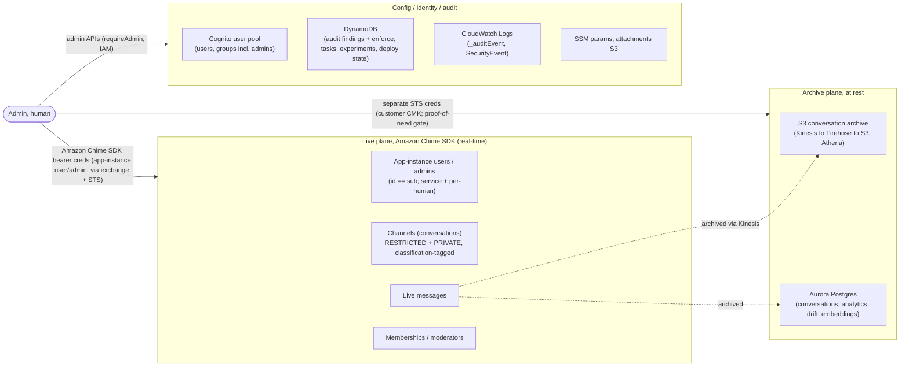

# SPEC: Admin Identity

**Status:** Implemented

The purpose of this document is to define the identity implementation for administrator and moderator actions in AgentEchelon: how admin identity is decided at deploy time, the levels of admin, how an admin's authority is provisioned, how admin actions are permitted and enforced, and how they are audited. Admin identity is configured with `adminAuthMode` and the related context flags in section 1.

Related: `ADMIN-INTEGRATION-GUIDE.md` (the two planes), `ADMIN-GUIDE.md` (deploy-time choices), `SPEC-ADMIN-CONSOLE.md` (dashboard actions), `IDENTITY-PROVIDER-GUIDE.md` (user IdP, post-authentication trigger), `SPEC-CREDENTIAL-EXCHANGE.md` (bearer-pinned Amazon Chime SDK creds), `SPEC-PER-TIER-OWNERSHIP.md` (tier-level assistants), `SPEC-NOTIFICATION-BRIDGE.md` (notification fan-out), `SPEC-ACCESS-AND-CONTROLS-AUDITING.md` (audit trail), `ACCESS-CONTROL-BY-EXAMPLE.md` (user-side enforcement matrix).

## 

## Admin scope and data-protection posture

**Data-protection and use-case calibration.** The capability set in this spec is modeled on an enterprise context where conversation messages are operational records, not personal user data. In that model admins archive, read across conversations, and delete as operators, and archive access. However, even in this context admins must provide and record a proof of need. In many cases this needs to be gated behind a workflow where that need is reviewed and approved before access is granted. This specification documents a simplified model that vends temporary administrator access to administrators based on their permissions and a recorded request and reason provided. This model can be extended to further restrict access as needed to, for example, tie to an IT ticket number or restrict access to users of a given type or region. Deployments that serve other use cases, like customer engagement will need to further enhance this feature set to address the needs of dealing with personal data, GDPR compliance etc.  This project provides a starting point, but production deployments must perform their own evaluation and ensure their specific needs are met.

Administrator actions here cover a broad set of capabilities that includes basic moderation tasks at the low end, and extend up to broader access and platform configuration.

### Two credential planes: live conversations vs the archive

Admin access to conversation content comes through two independent credential planes, controlled separately:

- **Live, active conversations (Amazon Chime SDK):** short-lived, bearer-pinned credentials tied to the admin's own chat **app-instance-user** `${sub}` (read, participation) or their separate **`${sub}-admin`** app-instance-admin (moderation), vended by the Credential-Exchange over STS and used by the admin as themselves (sections 3, 4). Amazon Chime SDK enforces the authority; de-provisioning the `${sub}-admin` revokes it.
- **The archive (messages at rest, S3 / Aurora):** not an Amazon Chime SDK bearer. Archived content is read through separate, short-lived STS credentials scoped to the archive. The archive is encrypted at rest with a customer-managed KMS key (`ArchiveKey`): SSE-KMS on the S3 archive and a CMK on the Aurora cluster (`analytics-stack-aurora.ts`). The per-request PROOF-OF-NEED gate grants decryption only against a valid, recorded request, so archive access is independently scoped, recorded, time-boxed, and revocable, and holding app-instance-admin does not by itself grant archive decryption. That gate needs the request/grants store; the CMK provides customer-managed encryption at rest, and the per-request access gate is the remaining piece (see Current state).

The archive is the more sensitive plane: it is the system of record, spans conversations and tiers, and persists after content is redacted or deleted in the live channel (see erasure, below). Controlling it separately from live moderation authority is deliberate.

### Where the data lives

Live conversation content lives in the Amazon Chime SDK; the durable copy and everything queried across conversations lives in the archive; identity, configuration, and the audit trail live in Cognito, DynamoDB, and CloudWatch. Admins reach each store through a different credential plane, as shown.

---

## Admin action taxonomy

### Platform configuration actions (admin-level)

These configure the platform rather than a single conversation. All are admin-level (super admin unless a restricted-admin capability is granted), run through server-side admin APIs gated by `requireAdmin`, and are recorded in the audit trail. Sensitive reads (for example the message archive) additionally require a recorded request and reason and vend temporary access, per the tenets above.

- **User lifecycle:** approve or reject registration, enable or disable, set tier, delete a user (`user-management.ts`).
- **Admin lifecycle:** add or remove a person from the `admins` group; grant or revoke a restricted-admin capability or a temporary elevation, with a recorded reason and an expiry.
- **Model and routing:** model-strategy, per-tier default model, and routing configuration (`model-resolver.ts`, `resolve-model-plan.ts`) plus the intent pack (`assistantIntentPack`).
- **Experiments:** create and adjust A/B experiments and their status (`admin-experiments.ts`).
- **Guardrails:** per-tier Bedrock Guardrail configuration.
- **Membership audit:** enable the audit, and toggle report-only vs auto-revoke (`membership-audit-admin.ts`).
- **Notifications:** admin notification-channel configuration and the notification-type routing table (section 8).
- **Retention and archive access:** retention windows and the archive-access policy, including the proof-of-need workflow and the encryption gate that vends archive-decrypt access only against a valid, recorded request.
- **Deploy-time (not the console):** `adminAuthMode` / admin IdP selection, tier definitions, and feature flags are CDK context, changed by redeploy rather than at runtime (section 1).

### Conversation-level actions (moderator vs admin)

These are scoped to a single conversation (channel). Two levels apply:
- **Moderator** is a `ChannelModerator` of the channel (the creator, or a member promoted via `CreateChannelModerator`). A channel can have several moderators, and a moderator may moderate several channels; authority is limited to the channels they actually moderate (not ownership).
- **Admin** is an app-instance-admin acting cross-channel, as themselves with their own bearer (section 4), on ANY conversation regardless of tier.

| Action                                                           | Moderator (channels they moderate)      | Admin (any channel)                                         | Amazon Chime SDK authority / note                                                          |
| ---------------------------------------------------------------- | --------------------------------------- | ----------------------------------------------------------- | ------------------------------------------------------------------------------- |
| Change conversation configuration (title, non-security metadata) | Yes                     | Yes | `UpdateChannel`                                                                 |
| Change classification / tier of a conversation                   | No (security-affecting)  | Yes | Alters tier gating; admin-level only                                            |
| Add or remove members                                            | Yes                     | Yes | `CreateChannelMembership` / `DeleteChannelMembership`                           |
| Promote a member to moderator                                    | Yes                     | Yes | `CreateChannelModerator`                                                        |
| Join as a non-visible (HIDDEN) observer                          | No                      | Yes | Observe or moderate a channel without being a visible member                    |
| Redact a message                                                 | Yes                     | Yes | `RedactChannelMessage`; moderator authority suffices                            |
| Delete a message                                                 | No                      | Yes | `DeleteChannelMessage` requires app-instance-admin; a moderator can only redact |
| Delete a conversation (channel)                                  | Yes | Yes | `DeleteChannel`                                                                 |

Every action above is performed by the actor as themselves with their own bearer (section 4) and is recorded in the audit trail (section 6). Moderator authority is channel-scoped; admin authority is cross-channel and tier-transcendent, and is the only level that can delete messages or act on a channel it does not moderate.

**Creating a conversation is not in this table**, because it is neither a moderator nor an admin action. It is a base user capability: any user creates a conversation through AE's own `create-conversation` function, which wraps the Amazon Chime SDK `CreateChannel` and adds AE logic (classification tagging, adding the tier assistant, RESTRICTED + PRIVATE settings). Raw `CreateChannel` is not granted to browser credentials. The creator is made the channel's `ChannelModerator` as a *consequence* of creating it, so moderator status is an outcome of creation, not a permission that authorizes it, a moderator of a channel cannot exist before the channel does. Admin conversations are provisioned at deploy/config time (sections 8 to 9), not created ad hoc from the console.

## Data-protection considerations for other deployments

This spec models an enterprise context where messages are operational records. Deployments where messages are personal data, or that answer to stricter data-protection regimes, will need further adjustments. The items below are **examples**, not a complete or prescriptive list, and **none of this is legal advice**: each production deployment must do its own due diligence to confirm it meets its obligations, and adapt the project accordingly.

- **Accountability for admin access:** record admin reads of user data (who, what, when, and ideally why), not only mutations. Read-access logging of the archive is a data-protection accountability requirement; the audit logs admin mutations but not cross-tier reads (section 6).
- **Erasure (delete is not erasure):** a moderation delete removes or redacts the live Amazon Chime SDK message but does NOT propagate to the append-only archive (S3 / Aurora), so the archived copy persists. A data-subject erasure must additionally remove the archived content; wire that path before relying on delete for erasure.
- **Retention:** bound retention per data category for the audit log and the archive (see `SPEC-ACCESS-AND-CONTROLS-AUDITING.md`).
- **Processors, residency, DPIA:** admin cross-conversation access to personal data can span data-residency boundaries and may warrant a DPIA; Bedrock, Amazon Chime SDK, and SES are sub-processors that need the appropriate data-processing terms.

Treat the privileges here as a least-privilege starting point for the enterprise case, not a fixed policy.

---

## Current state

Most of this model ships. The main gap between what is live and the full design is the **archive plane's per-request proof-of-need decrypt gate** (the customer-managed CMK itself is implemented, below). This section states what is live; the rest of the spec is present tense.

- **Shipped:** each admin moderates **as themselves, client-side, with their own bearer**. The Credential-Exchange vends per-channel, short-lived, audited admin creds on `identity:'admin'`, pinned to the admin's SEPARATE `${sub}-admin` identity, a standing app-instance-admin provisioned at the exchange on first use; the admin console calls Amazon Chime SDK redact / delete / membership directly (`chimeService.ts`, `adminConversationService.ts`). The admin's **chat** identity `${sub}` is never elevated. The **service** app-instance-admin is used only for no-human automation (e.g. membership-audit auto-revoke), and the reconcile sweep de-provisions demoted admins (`admin-conversation-sync.ts`). Every scoped admin vend emits an `admin_scoped_credential_vend` record.
- **Implemented, applied on the next deploy/recreate:** the archive's customer-managed CMK (`ArchiveKey`). Aurora mode: the CMK encrypts the Aurora cluster storage plus SSE-KMS on the S3 archive (`analytics-stack-aurora.ts`). Athena mode: SSE-KMS on the S3 conversation archive, with the Firehose writers, Athena readers, and the admin-conversations reader all granted key access (`analytics-stack.ts`). Applying the Aurora CMK to an existing cluster replaces it (RDS cannot re-key in place), so it is intended for a fresh deploy.
- **Not yet shipped:** the per-request PROOF-OF-NEED decrypt gate (vend archive decrypt only against a recorded request), which needs the request/grants store; the `withAdmin` / `requireAdminCapability` wrapper; and the restricted-admin level.

---

## 1. Two identity decisions at deploy time

AgentEchelon makes two independent identity-provider decisions at deploy time, not one.

| Decision | Default | Can change | Why it differs |
|----------|---------|------------|----------------|
| **User IdP** | AE Cognito user pool | OIDC/SAML federation, a host `federatedUserPoolId`, or guests with no IdP | The user population varies by use case, across providers or guests. |
| **Admin IdP** | AE Cognito user pool (`admins` group) | `adminAuthMode` = `federated` (host admin pool) or `service` (IAM) | Admin authority comes from one source and stays there; spreading it multiplies what can mint an admin. |

The user IdP widens over time; the admin IdP stays singular. `adminAuthMode` (`backend/lib/constructs/admin-auth-mode.ts`) selects the admin plane: `ae-cognito` (default), `federated` (host pool, `ADMIN_GROUP_NAMES` claim), or `service` (SigV4). The handler-side gate is always `requireAdmin(event)` / `callerIsAdmin(event)` (`backend/lambda/src/lib/auth.ts:204,170`); see section 12.

### 1.1 Sign-in flow (admins may sit in a different IdP)

Because the admin IdP can differ from the user IdP, the sign-in flow follows `adminAuthMode`:

- **`ae-cognito` (default):** users and admins are the same pool. One sign-in, one token; admin is the `admins` group claim. The admin API authorizer validates that pool and `requireAdmin` checks the group. Sign-in is unified because one pool is authoritative.
- **`federated`:** admins live in a different pool/provider, so admin sign-in is a separate entry point (a distinct login or SSO redirect to the admin IdP) producing a distinct token, and a leaked user session never carries admin. The admin API authorizer points at the admin pool (`hostAdminPoolId`); the frontend sends the admin token to admin endpoints and the user token to user endpoints, so a person who is both holds two sessions (the console makes the active plane explicit and does not silently mix tokens). AE does not own the host pool, so facet C (section 3) is provisioned at AE's own boundary, the Credential-Exchange (section 9), rather than a Cognito trigger.
- **`service`:** no interactive admin sign-in; a trusted backend principal calls with SigV4.

### 1.2 Creating an admin

Creating a new admin means creating the person in the admin IdP with the configured admin group. Admin authority is the group/claim, so granting it is a group assignment, there is no separate "make admin" API beyond the user-management admin-group operations.

- **Cognito (default):** create the user in the admin pool (the AE user pool by default) and add them to the `admins` group. Everything else follows: the provisioning step (section 9) creates their `${sub}-admin` identity and registers it as an `AppInstanceAdmin` on the first admin vend, and the reconcile sweep keeps their chat identity a member of the admin conversations their level requires.
- **Other IdPs (`federated` / `service`):** the exact steps vary by provider, but the requirement is the same, create the user in the configured admin IdP and assign the configured admin group/claim (`ADMIN_GROUP_NAMES`). AE gates on that claim and provisions facet C at its own boundary (the Credential-Exchange, section 9), since it does not own the host pool.

---

## 2. Admin is graded, not binary

There is a service identity, and human admins at graded capability levels. Levels differ in which Amazon Chime SDK identity they hold, which IAM ceiling their credentials carry, and which capabilities they may exercise.

| Level                          | Who                                            | Amazon Chime SDK identity                                                                                   | Capability ceiling                          | Purpose                                                                                                                                               |
| ------------------------------ | ---------------------------------------------- | ------------------------------------------------------------------------------------------------ | ------------------------------------------- | ----------------------------------------------------------------------------------------------------------------------------------------------------- |
| **Service app-instance-admin** | Non-human service user (`agent-echelon-admin`) | Registered `AppInstanceAdmin`                                                                    | Its own scoped moderation role              | No-human automation such as membership-audit auto-revoke, where no person is acting; the human moderation path is each admin's own bearer (section 4) |
| **Super admin**                | Every human admin, by default                  | Two identities: chat `${sub}` (never elevated) and a separate `${sub}-admin` registered as `AppInstanceAdmin` | Full admin moderation policy                | Full dashboard + admin APIs, and acting as themselves in the Amazon Chime SDK context                                                                            |
| **Restricted admin**           | Human, a defined capability subset             | Chat `${sub}`, plus a `${sub}-admin` (registered `AppInstanceAdmin` only if the subset needs cross-channel authority) | Scoped subset policy, optionally time-boxed | A subset of admin capabilities                                                                                                                        |

- **The elevation lives on a SEPARATE `${sub}-admin` identity, never the chat identity `${sub}`.** That identity only ever receives channel-scoped, short-lived, audited creds, so its standing elevation can never attach to a broad chat credential (section 4). A restricted admin gets a `${sub}-admin` only if its subset needs cross-channel authority.
- **Multiple app-instance-admins, not one shared credential.** Per-human identities make revocation real: de-provisioning a person's `${sub}-admin` (section 9) stops their Amazon Chime SDK authority. A single shared credential could not be revoked per person.
- **Backend processes run as the tier-level assistants** (`SPEC-PER-TIER-OWNERSHIP.md`), not the service admin, which is reserved for no-human automation (e.g. membership-audit auto-revoke). This keeps the powerful identities off the default path.

---

## 3. The facets, and how they vary by level

| Facet | What it is | Super admin | Restricted admin |
|-------|-----------|-------------|------------------|
| **A. Admin authority claim** | `admins` group / `ADMIN_GROUP_NAMES` claim in the admin IdP | Required | Required + capability/scope claim |
| **B. Vended access creds** | The admin's own bearer-pinned Amazon Chime SDK creds from the Credential-Exchange. `identity:'chat'` vends chat creds on the chat identity `${sub}`; `identity:'admin'` vends channel-scoped, short-lived, audited moderation creds on the `${sub}-admin` identity, just-in-time (section 10), all exercised as themselves | Full access + moderation | Scoped subset |
| **C. Amazon Chime SDK identity** | Two: the chat identity `${sub}` (never elevated) and a separate `${sub}-admin` registered as `AppInstanceAdmin` when the level needs cross-channel authority | chat + `${sub}-admin` | chat + `${sub}-admin` only if needed |

Facet A is authoritative and comes only from the admin IdP claim. `custom:tier` never grants admin; admin-group writes are only via the admin-gated user-management path plus the pool-scoped trigger IAM (`cognito-auth-stack.ts:229`), so there is no self-promotion primitive.

Facet B is the admin's own bearer credential, delivered through the same Credential-Exchange that vends chat users their Amazon Chime SDK creds (`chimeService.ts` calls the exchange API), just the `admin` rung. All Amazon Chime SDK credentials, admin included, are short-lived, bearer-pinned creds from the exchange (`cognito-auth-stack.ts:329-343`). The admin's entitlement (the facet A claim plus the app-instance-admin association, facet C) is what lets the exchange vend moderation-capable creds; those creds are issued just-in-time against a recorded request (section 10), are short-lived, and the admin redacts, deletes, and changes membership AS THEMSELVES with their own bearer. `AdminAuthenticatedRole` is empty and is not the admin's Amazon Chime SDK authority. No component ever wields these creds on the admin's behalf; the admin uses them from their own client (section 4).

The service app-instance-admin is separate from all human facets, tied to no person; it and the per-human associations coexist.

---

## 4. How admins are permitted to act on non-admin (tier-tagged) conversations

A non-admin conversation is a channel tagged with a tier `classification`. A user's own creds carry an IAM Deny on channels tagged with a higher tier (`SPEC-CONVERSATION-SECURITY` Layer 1), so a user cannot touch a higher-tier channel. An admin acts across tiers, and does so AS THEMSELVES with their own bearer, never through a component acting on their behalf.

**Two identities, always their own bearer.** Each admin holds two Amazon Chime SDK identities, and the exchange vends for one or the other by an `identity` parameter on the request (`credential-exchange.ts`):
- **Chat identity** `${appInstanceArn}/user/${sub}` (`identity:'chat'`, the default): the admin's ordinary user, vended the same short-lived, bearer-pinned creds any chat user gets. It is **never** a registered app-instance-admin, so Amazon Chime SDK membership-gates it exactly like any user, and it reads and participates only where the admin is a member. The admin rung differs from a tier rung only in dropping the cross-tier `classification` Deny (`cognito-auth-stack.ts`), so the admin can be a member of channels across tiers.
- **Admin identity** `${appInstanceArn}/user/${sub}-admin` (`identity:'admin'`): a SEPARATE app-instance-user, registered as a **standing** `AppInstanceAdmin`, carrying the moderation ceiling (redact, delete, membership changes). The exchange only ever vends it a credential **scoped to one channel** (a `channelArn` is required, else the request is rejected), **short-lived**, and **recorded** (an `admin_scoped_credential_vend` audit event). The admin console calls Amazon Chime SDK redact / delete / membership directly from the browser with this bearer (`chimeService.ts`, `adminConversationService.ts`).

**Why two identities and not one elevated user.** An `AppInstanceAdmin`'s reads are NOT membership-gated (`GetChannelMessage` / `ListChannelMessages` are Allowed on any channel, per the AWS authorization-by-role reference), whereas a non-member is denied read on a PRIVATE channel. So if the admin's CHAT identity were a standing app-instance-admin, its broad `channel/*` chat credential could silently read every conversation with no scoped, recorded request. Putting the standing elevation on a SEPARATE identity that only ever receives channel-scoped, short-lived, audited creds means cross-channel authority can never attach to a chat credential: a chatting admin is membership-gated, and every cross-channel read or moderation leaves an attributable record. Elevation is a property of the *identity*, not the credential, so separating the identities is what makes a standing elevation safe.

Delete specifically requires app-instance-admin (a channel moderator can only redact), which is why the admin identity carries it. No server-side component holds, swaps, or wields either bearer; the admin acts from their own client, and each credential is pinned to its own ARN (the chat cred to `${sub}`, the admin cred to `${sub}-admin`). Both are issued only by the exchange, never reachable via the Identity Pool (the identity-pool roles stay powerless per `cognito-auth-stack.ts`).

**An admin is also a chat user.** The exchange's default vend is ordinary chat (`view` + `participate`) on the conversations the admin belongs to, gated by Amazon Chime SDK membership; moderation capabilities are requested explicitly and scoped per request (section 10). So an admin signed in for chat has normal chat access and holds no standing moderation power, moderation is only the extra, per-request scoped capability on top. In `federated` mode, where admins sit in a separate pool, chat happens under the person's user-pool session and admin actions under their admin-pool session (the two-session model, section 1.1).

The **service** app-instance-admin is used only for genuinely no-human automation (for example membership-audit auto-revoke), where there is no person acting. It acts as itself, never on behalf of a person.

---

## 5. Admin actions and how they are enforced

| Action | Acting identity | How it is allowed | Tier interaction | Level |
|--------|-----------------|-------------------|------------------|-------|
| View/navigate any conversation + messages | Archive plane (S3 / Aurora), not an Amazon Chime SDK bearer | `requireAdmin` + a recorded request; separate short-lived STS creds, KMS-gated; read-only over the archive | Reads across tiers (archive is system of record) | super; read/audit subset |
| Read live channel membership | The admin, own bearer (client-side) | `ListChannelMemberships` with the admin's own app-instance-admin bearer; Amazon Chime SDK authorizes | Cross-channel via app-instance-admin | super; audit subset |
| Redact a message (any channel, incl. live user conversation) | The admin, own bearer (client-side) | `RedactChannelMessage` with the admin's own app-instance-admin bearer; Amazon Chime SDK authorizes; the admin rung's role omits the cross-tier Deny | Tier-transcendent | super; moderation subset |
| Delete a message (any channel) | The admin, own bearer (client-side) | `DeleteChannelMessage` with the admin's own bearer; delete requires the caller be an app-instance-admin (the admin is) | Tier-transcendent | super; moderation subset |
| Add a member / add-self to a channel | The admin, own bearer (client-side) | `CreateChannelMembership` with the admin's own bearer | Tier-transcendent | super |
| Add a membership as **non-visible (HIDDEN)** | The admin, own bearer (client-side) | `CreateChannelMembership` with `Type: HIDDEN` (add-self defaults to HIDDEN), as the admin's own bearer, so they observe/moderate a live channel without appearing in its roster | Tier-transcendent | super; moderation/audit subset |
| Promote a member to moderator | The admin, own bearer (client-side) | `CreateChannelModerator` with the admin's own bearer | Tier-transcendent | super |
| Remove a member (membership-audit revoke) | The admin, own bearer (client-side); service admin when auto-revoking | `DeleteChannelMembership` as the admin's own bearer; auto-revoke runs as the service identity | Tier-transcendent | super; audit subset |
| Moderate within an admin conversation as self | The admin, own bearer (facet C) | the admin's own app-instance-admin bearer | Within the admin channel | super |
| User management (approve, set tier, add/remove admins group) | Cognito admin APIs; pool-scoped IAM | `requireAdmin`; pool-scoped trigger/exec IAM (`cognito-auth-stack.ts:229`) | Governs tier assignment; cannot self-promote | super; user-mgmt subset |
| Toggle membership-audit enforce / auto-revoke | DynamoDB config; auto-revoke acts as the service admin | `requireAdmin` (`membership-audit-admin.ts`) | n/a | super; audit subset |
| Impersonate / act AS a user | None: no path | Blocked: bearer pinning to the caller's own ARN, no assume-into-user path, classification cap | An admin only ever acts as themselves, never as another user | n/a |

Every Amazon Chime SDK action, including moderation, is performed by the admin AS THEMSELVES with their own bearer-pinned creds from the exchange, pinned to their own ARN, so they can only ever act as themselves and no component acts on their behalf. The server-side admin APIs that remain (user management, the audit-enforce toggle, archive reads) gate on `requireAdmin` and do not wield Amazon Chime SDK bearers. Automated, no-human paths (membership-audit auto-revoke) act as the service app-instance-admin. Live creds are vended just-in-time against a recorded request and are short-lived (section 10); archive reads use the separate STS + KMS plane, not an Amazon Chime SDK bearer (see "Where the data lives").

### 5.1 Admins acting on live non-admin conversations and users

- **Identity, not impersonation:** the admin acts as themselves, with their own bearer, using their own app-instance-admin authority, without becoming a persistent member and without the user's credentials or context. No component mints or wields a user's bearer for an admin; assume-role into a user identity is blocked (see `ACCESS-CONTROL-BY-EXAMPLE.md`).
- **Tier transcendence is a property of the admin's own app-instance-admin identity** (section 4), which is why it is gated to super admins and specific capabilities. The admin's own creds carry cross-tier access AND moderation, pinned to their own ARN, so an admin can only ever act as themselves, never as a lower-level admin or another user.
- **Visibility:** the admin is not shown in the roster when they act on a channel they are not a visible member of, or when joining as a non-visible (HIDDEN) membership (section 5) to observe or moderate; the user sees only the effect (a redaction, a removal), not the admin's presence.
- **Every such action is audited to the acting human** (section 6), at both the Amazon Chime SDK layer (the human's app-instance-admin ARN) and the app audit event.

---

## 6. Auditing of admin actions

Every admin action is audited, and attribution is to the acting human even when the action runs via the shared service app-instance-admin.

- **Where:** admin handlers emit a structured `_auditEvent` record. `admin-conversations.ts:396-560` logs `admin_self_add` / `admin_redact` / `admin_delete` / `admin_add_member` / `admin_remove_member`, and `membership-audit-admin.ts` logs enforce/revoke, each with `{ _auditEvent, timestamp, adminSub, action, target }`. The `withAdmin` / `requireAdminCapability` wrapper (section 12) emits the record for every gated call, so auditing is by construction.
- **What is captured:** timestamp, acting human `sub` (from `requireAdmin(...).claims.sub`), `adminAuthMode`, level/capability exercised, action, target (channel / member / message ARN), parameters, and result. When the executing identity is the service admin, both the service identity and the acting human are recorded, so the shared identity never anonymizes the actor.
- **Reads too (a data-protection accountability requirement):** read actions that expose cross-tier content (viewing another tier's conversation, listing membership) must be audited as well as mutations, because the sensitive event is the cross-tier access itself. The audit covers mutations; admin reads are not logged.
- **Full path:** the audit records the whole access lifecycle, not just the action, the request and its reason, the credentials vended, the access used, the action taken, and the revoke or expiry (per the tenets and section 10), so access is reviewable end to end.
- **Persistence and retention:** to the audit log group and the analytics archive; security-relevant findings (over-tier membership, revocations) also land in the membership-audit table. `SPEC-ACCESS-AND-CONTROLS-AUDITING.md` holds the retention and tamper-resistance posture (append-only, retained); this spec defers to it.

---

## 7. Admin conversations and admin assistants

An **admin conversation** is an Amazon Chime SDK channel restricted to admins whose participants include one or more **admin assistants** (assistants with admin-only tools and context). Membership is by level: a super admin joins as an app-instance-admin (moderation authority inside the channel); a restricted admin joins with an elevated app-instance-user when their subset does not need cross-channel authority; the service identity is not a human participant. Being a member needs only an app-instance-user (every confirmed user has one); the elevated identity is what gives the admin the authority appropriate to their level, rather than acting as a plain member.

---

## 8. Admin notification conversations: membership sync and notification types

Admin **notification conversations** are the channels the notification bridge fans out from (`SPEC-NOTIFICATION-BRIDGE.md`). `fanOutChannelNotification` (`channel-notify.ts:191`) resolves the roster from the channel Metadata `participants[]` (`:133`, deliberately not from raw channel membership) and emails each member via SES. `selectNotifyRecipients` filters to a target subset (`targetSubs`) and `iss` resolves the right pool per participant, so type-scoped and cross-IdP routing (below and section 8.1) build on that seam. Email is the first delivery channel; other channels (SMS, PSTN, webhook) attach at the interface layer without changing the roster model.

Membership stays in sync with the admin set (the source of truth is the admin IdP claim, section 3). Because admin-group changes happen out of band (there is no wired group-change event), the reconcile sweep is the authoritative mechanism, with a sign-in add for freshness:

- **Reconcile sweep (primary):** a scheduled job resolves the admin set from the admin IdP (the Cognito `admins` group, filtered by level for level-scoped channels, section 8.1) and syncs each admin conversation: add admins who are missing, remove members who are no longer admins (never removing bots or admin assistants), and update the Metadata `participants[]` the bridge reads. It runs as the service app-instance-admin, an automated no-human path (section 4).
- **Add at sign-in (freshness):** when an admin exchanges creds, the provisioning step (section 9) also ensures they are a member of the admin conversations their level requires, so a new admin appears without waiting for the next sweep.
- **Event-driven (when wired):** Cognito has no native group-change Lambda trigger, but the group-management API calls (`AdminAddUserToGroup` / `AdminRemoveUserFromGroup`) are recorded by CloudTrail, so an EventBridge rule matching those events can invoke a Lambda to update the roster and de-provision the `${sub}-admin` near-immediately (section 14). A deployment that instead routes admin-group changes through its own API or hook (for example a demote-admin operation) can update the roster synchronously in that same call. Absent either, the reconcile sweep is authoritative.
- **Provisioning:** the admin conversation is a deploy-time option; when none exists, the deploy option creates one and seeds `participants[]` from the resolved admin set.

**Different notification types** route to different conversations. A notification carries a type (membership-audit alert, deployment/cost event, moderation flag, and so on); a routing table maps each type to the target admin conversation(s), so not every admin is paged for every event.

Email delivery requires an email attribute on the admin's profile in the admin IdP: the bridge resolves each recipient's address from the pool (SES `AdminGetUser`), so an admin without a usable email in the IdP receives in-app delivery only until another channel (SMS, PSTN, webhook) is attached. Membership in the admin conversations an admin is required to be in is ensured at sign-in and by the reconcile sweep above (section 9).

### 8.1 When a conversation admits only admins of a specific level

When an admin conversation is restricted to admins of a specific level or capability (for example a super-admin-only security channel, or a channel for a single restricted capability), the sync is level-aware:

- The roster is derived from the admin set filtered by the channel's required level/capability claim, not the whole admin set. Membership is a function of the claim, resolved per channel.
- Facet C per channel follows the requirement: a super-admin-only channel requires app-instance-admin membership; a channel open to restricted admins accepts elevated app-instance-users.
- On a level change (a super admin downgraded to restricted, or a temporary elevation expiring), the event-driven path adds or removes the person from exactly the channels their new level qualifies for, and the reconcile sweep verifies per-channel level membership, not just presence in the admin set.
- Notification routing is itself level-scoped: a type that should reach only super admins targets a super-admin-only conversation, so level filtering happens once, at the channel roster, rather than per message.
- **Enforced the same way as tier gating, keyed on admin level.** A level-restricted admin conversation carries a required-level/capability tag, the same `classification`-tag mechanism that gates tier channels (`SPEC-CONVERSATION-SECURITY.md`), so exchange and channel-flow enforcement apply to it exactly as they do to a tier channel, keyed on the admin claim rather than the user tier. As a backstop, the membership-audit stream (Layer 6, the Kinesis consumer `membership-audit.ts`) watches `CREATE_CHANNEL_MEMBERSHIP` events on these channels and flags, or auto-revokes, any member whose level does not meet the channel's requirement, catching a wrong-level admin added out of band, exactly as it catches an over-tier user on a tier channel.

---

## 9. Provisioning admin identity

Provisioning establishes an admin's ENTITLEMENT: the separate `${sub}-admin` app-instance-user, registered as an `AppInstanceAdmin` (facet C), that carries what they may do. It does not hand the admin standing, usable moderation credentials; those are vended just-in-time, channel-scoped, against the admin identity (section 10). The chat identity `${sub}` is never registered. Provisioning does not block sign-in.

- **At the exchange boundary (all modes, authoritative):** the Credential-Exchange is the fail-closed point. On the first `identity:'admin'` vend it verifies the admin claim, then idempotently creates `${sub}-admin` and registers it as an `AppInstanceAdmin` (`ensureAdminIdentity` in `credential-exchange.ts`) before issuing the scoped, short-lived cred. Because provisioning happens at AE's own boundary it works even in `federated` mode, where AE cannot attach a trigger to the host pool. Moderation is gated by Amazon Chime SDK: the admin identity carries authority only while its registration exists, so a missing or revoked registration fails moderation closed, and the console surfaces a clear "moderation authority not provisioned" state.
- **Optional pre-provisioning (`ae-cognito`):** a `PostAuthentication` trigger on the admin pool may pre-create `${sub}-admin` at sign-in so the first moderation has no cold start, but the exchange remains the authoritative gate and never trusts user-writable attributes.
- **Required-conversation membership:** the admin's CHAT identity `${sub}` is kept a member of the admin conversations their level requires (the reconcile sweep, section 8), updating the channel `participants[]` the notification bridge reads. The `${sub}-admin` identity is a member of nothing; it acts membership-free.
- **IAM:** the exchange role grants `chime:CreateAppInstanceUser` + `chime:CreateAppInstanceAdmin` (scoped to `${appInstanceArn}` and `.../user/*`); the reconcile sweep's role grants `chime:DeleteAppInstanceAdmin` + `chime:DeleteAppInstanceUser` for de-provisioning. No standing delete authority sits on the exchange.

De-provisioning is explicit and handled by the reconcile sweep (section 14).

---

## 10. Access is just-in-time: requested, recorded, temporary

Elevated access is not standing. An admin holds an entitlement (section 9); to act, they make a recorded request that carries a reason (and, for sensitive scope such as archive reads, an approval, extensible to an IT-ticket reference or a restriction by user type or region). Access is then vended temporarily, used, and revoked, and the full path is recorded (section 6):

- **Request:** the admin states the scope and a reason; sensitive scope is reviewed and approved before anything is vended.
- **Vend (two planes):** the live plane vends short-lived, bearer-pinned Amazon Chime SDK creds from the Credential-Exchange (STS), the chat identity `${sub}` for participation and the `${sub}-admin` identity for channel-scoped moderation; the archive plane vends separate short-lived STS creds gated by the archive KMS key. Both are scoped to the admin's entitlement and the requested scope.
- **Scoped to the ARN (a benefit of this architecture):** because every user, channel, and message is an ARN, a vended STS credential can be narrowed to exactly what the request needs, a single conversation, a single user, a message, rather than a whole tier. A narrow request yields narrowly-scoped creds, so least-privilege is enforced by the credential itself, per request.
- **Use:** the admin acts as themselves; each action is recorded.
- **Revoke:** the creds expire (short STS TTL), and de-provisioning the entitlement (section 14) revokes the ability to vend more.

Enforcement layers under this:

- **Claim layer (source of truth):** the admin IdP carries the capability/scope and expiry. Expiry lives where the principal cannot edit it: an admin-only-writable attribute or a backend grants store, not a user-writable `custom:` attribute. It is enforced by the exchange and the reconcile sweep.
- **IAM layer (ceiling):** the exchange issues a scoped role for the subset, narrowed to specific channel or user ARNs where the request warrants it, so the admin's creds cannot exceed the granted capabilities or scope even if an app check is missed.
- **Amazon Chime SDK layer:** facet C is provisioned to the minimum needed (elevated app-instance-user vs app-instance-admin).
- **App layer:** admin handlers check the specific capability (`requireAdminCapability(event, cap)`), not just whether the caller is an admin.

A temporary grant ends by expiry at the claim layer and by the de-provision path (section 14), so neither a stale claim nor a lingering Amazon Chime SDK association outlives the grant.

---

## 11. Admin dashboard

Access is gated by the `admins` group (or `ADMIN_GROUP_NAMES`); every admin API independently re-checks via `requireAdmin`. Amazon Chime SDK moderation is performed from the admin's own client as their own bearer (they are an app-instance-admin), so it is attributed to the admin at the Amazon Chime SDK layer and does not depend on the admin being a visible channel member; the dashboard's remaining server-side APIs (user management, the audit-enforce toggle, archive reads) gate on `requireAdmin` and wield no Amazon Chime SDK bearer; automated, no-human actions use the service app-instance-admin (SSM `/agent-echelon/app-instance-admin-arn`). The acting human is captured for audit (section 6), and restricted-admin capability checks apply to dashboard endpoints too.

---

## 12. Handler gate (all modes)

Every admin Lambda gates with `requireAdmin(event)` / `callerIsAdmin(event)` (`auth.ts:204,170`), the one mode-aware check. The API-Gateway authorizer only authenticates; it does not decide admin (in `ae-cognito` any authenticated user would pass, and in `service` there is no JWT), so the gate lives in the handler. Admin handlers are wrapped in a single, capability-aware `withAdmin(handler)` / `requireAdminCapability` helper, so the gate and the audit emission (section 6) are applied by construction. The construct side spreads `...adminAuthEnv(this)` and builds method options with `adminApiMethodOptions(...)` (`admin-auth-mode.ts:52,69`), so gateway and handler resolve the same mode and, in `federated`, the same admin pool.

---

## Verification

The security claims here are verified by deny-tests, not review: a non-admin (and an authenticated non-admin) is denied on every admin route in each `adminAuthMode`; an admin cannot act as another admin's or a user's identity (the bearer is pinned to the caller's own ARN); provisioning fails closed when the level cannot be established; and de-provisioning revokes moderation on the next call. Each new admin endpoint adds a deny-test alongside the `withAdmin` wrapper.

---

## 13. Components

- **Admin auth mode + gate:** `admin-auth-mode.ts` (`adminAuthMode`, `adminAuthEnv`, `adminApiMethodOptions`), `auth.ts` (`requireAdmin` / `callerIsAdmin` / `requireAdminCapability`).
- **Identity provisioning:** `cognito-auth-stack.ts` (user pool, tier + `admins` groups, `PostConfirmation` / `PreAuthentication` / `PostAuthentication` triggers, `CognitoTriggersRole`), `create-app-instance-admin.ts` (service app-instance-admin), the Credential-Exchange admin rung (`credential-exchange.ts`).
- **Admin actions:** `admin-conversations.ts` (moderation, HIDDEN membership), `membership-audit-admin.ts` (findings, enforce toggle, revoke), `user-management.ts` (approve, tier, admin-group lifecycle).
- **Notification + reconcile:** `channel-notify.ts` (fan-out from `participants[]`), `membership-audit.ts` (Layer 6 reconcile).

---

## 14. Security properties

- **Single source of admin authority.** Admin status derives only from the admin IdP claim; trigger IAM is pool-scoped, so it cannot mint an admin elsewhere.
- **Near-immediate revocation.** Removal from the admin group (or grant expiry) synchronously calls `DeleteAppInstanceAdmin`, drops the person from admin conversations, and the exchange refuses new admin creds immediately; the membership-audit reconcile sweep is a short-interval backstop, and short-lived exchange creds bound any in-flight session. This is why per-human identities exist: a shared credential could not be revoked per person.
- **Least privilege by level.** app-instance-admin only where cross-channel authority is needed; restricted admins hold elevated app-instance-users and scoped roles; backend work runs as the tier-level assistants.
- **One credential path.** Browser creds come from the exchange (bearer-pinned, attributable), not an identity-pool role, so there is a single Amazon Chime SDK-credential path and no parallel over-grant.
- **Attribution at both layers.** Human-initiated actions run as the human's own app-instance-admin ARN (Amazon Chime SDK-layer attribution) and record the acting human in the app audit event (section 6).
- **Fail-closed provisioning.** A principal that cannot be provisioned to exactly its resolved level is not issued admin creds.
- **Access is just-in-time and recorded.** Elevation is not standing: usable creds are vended only against a recorded request and reason, are short-lived, and the full request, vend, use, and revoke path is recorded (sections 10, 6). There is no standing usable moderation credential sitting at rest to steal, and because every resource is an ARN a vended credential can be scoped down to a single conversation or user.
- **Blast radius bounded by pinning and revocation.** The admin's own bearer carries moderation authority, so a stolen admin session can moderate, but only as that admin, only for the short life of an already-vended credential, and only where a request was already recorded: the creds are pinned to the admin's own ARN (no impersonation of any other user or admin), fresh creds require a fresh recorded request, and de-provisioning the entitlement revokes the ability to vend more in one step. Because no component ever wields a user's bearer, compromising a server-side Lambda grants no Amazon Chime SDK authority at all. Because these creds live in the admin console, the following are requirements, not options: admin MFA (the pool supports TOTP), XSS hardening of the admin console, short-lived exchange creds, and scoped or temporary grants for anyone who does not need super-admin.

---

## Appendix: Legal hold and data holds (potential future architecture, not in initial launch)

Not built and not on the initial-launch roadmap. This sketches where holds would attach if a deployment needs e-discovery or legal hold:

- **Immutable retention on the archive:** S3 Object Lock (WORM / compliance mode), or an equivalent Aurora policy, applied to a hold set so held content cannot be deleted or expired, by retention or by a moderation delete, until the hold is released.
- **Hold as a first-class record:** a hold names a scope (conversations, users, a time window), a reason, and a custodian, recorded in the same audit store as access. Placing and releasing a hold are themselves audited admin actions.
- **Interaction with erasure:** a legal hold supersedes a data-subject erasure for the held scope; the erasure request is recorded and deferred, not dropped, and runs when the hold releases.
- **Two-plane fit:** holds are an archive-plane concern (the archive is the system of record); the live Amazon Chime SDK plane is transient and is not the hold surface. A hold pauses archive expiry and can freeze KMS-gated access to read-only-for-legal.
- **Scoped reviewer access:** e-discovery review is a restricted-admin capability with its own recorded proof-of-need, scoped to the hold set and time-boxed, separate from operational moderation.

Production deployments with legal obligations must design and validate their own hold and e-discovery process; this is design intent, not a launch feature.
